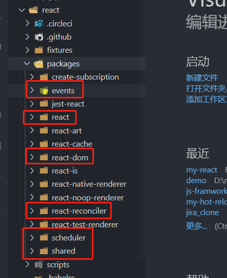
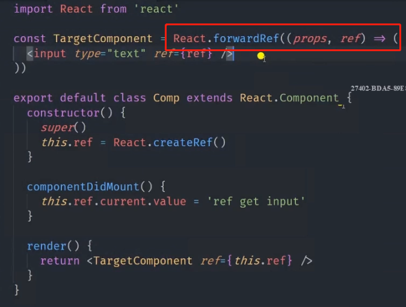

## 2.1 准备工作

[课程项目代码](<https://gitee.com/zhaodave/react-class-source-code>)

[课程书籍](<https://react.jokcy.me/book/api/react-structure.html>)

下面是我们需要关心的react源码：




##  2-2 JSX到JavaScript的转换

[在线尝试](<https://www.babeljs.cn/repl>)

```react
function Comp(){
    
}
// 函数式组件会转换成如下： 
React.createElement(Comp,{...})
                         
// 如果是小写 ，会当作字符串处理                         
React.createElement("comp",{...})                        
                       
```


##  2-3 react-element

代码文件：`ReactElement.js`

```javascript
function createElement(type,config,children){
    
}
```


- `ref,key,__self,__source` 这几个默认props会被处理掉
- `Component.defaultProps`  的处理，就是直接赋值到props上
- `$$typeof` 正常情况下都是  REACT_ELEMENT_TYPE，这个用来 标识元素类型。和type有点区别。渲染的时候有区别，平台有关。

```react
const ReactElement = function(type, key, ref, self, source, owner, props) {
  const element = {
    // This tag allows us to uniquely identify this as a React Element
    $$typeof: REACT_ELEMENT_TYPE,

    // Built-in properties that belong on the element
    type: type,
    key: key,
    ref: ref,
    props: props,

    // Record the component responsible for creating this element.
    _owner: owner,
  };
}
```

##  2-4 react-component

```javascript
代码文件：ReactBaseClasses.js
```


三个参数：

```react
function Component(props, context, updater) {
  this.props = props;
  this.context = context;
  // If a component has string refs, we will assign a different object later.
  this.refs = emptyObject;
  // We initialize the default updater but the real one gets injected by the
  // renderer.
  this.updater = updater || ReactNoopUpdateQueue;
}
```

之所以用updater是因为可以跨平台。

```javascript
 this.updater.enqueueSetState(this, partialState, callback, 'setState');
```


`PureComponent` 在`ReactBaseClasses.js`只多了个属性：

```react
pureComponentPrototype.isPureReactComponent = true;
```

`PureComponent` 继承了Component


## 2-5 `react-ref：createRef & ref`

代码文件：`React.CreateRef.js`

使用的三种方式：

1. string   ` <p ref="strRef"></p>` // 已经废弃
2. 函数    `<p ref={el=>this.el = el } >`
3. `React.createRef()`     `<p ref={this.ref}></p>`   
   - 使用： `this.ref.current`

```react
源码 ：
只是创建了一个对象。

export function createRef(): RefObject {
  const refObject = {
    current: null,
  };
  if (__DEV__) {
    Object.seal(refObject);
  }
  return refObject;
}
```


## 2-6 forward-ref

用于向函数组件传递



React.forwardRef() 包装的组件的$$type 为  REACT_Forward_REF_Type

注意：


##  2-7 context

代码：`ReactContext.js`

- `childContextType (废弃)  getChildContext()` 然后子组件就能用了。废弃原因：对子组件性能不好，只要上层变动，则所有子组件都会被重新渲染。
- createContext   React.createContext("default")

源码实现：

- Provider._context 指向context
- Consumer 指向 context


## 2-8 concurrent-mode

```react
 <ConcurrentMode>
    <Parent />
  </ConcurrentMode>
import { flushSync } from 'react-dom'
使用这个方法： 表示任务优先级高，dom渲染快，但是会影响动画流畅度
不使用：表示优先动画，然后执行React任务
```

具体看的demo:

<http://localhost:3000/concurrent>


## 2-9 suspense-and-lazy

demo:<http://localhost:3000/suspense>

在suspense下面，必须要所有的 promise都完成。才会渲染。


## 2-10 hooks

在demo的node_modules文件夹的`react/cjs/react.development.js`下面里面调用了：


就是在`react-dom`真正渲染时，会给这个赋值。


## 2-11 children

- 展开
  - React.Children.map(props.children,c=>[c,c,[c,c]]) // 这边React会帮我们展开	
  - 10个长度的缓存池
  - 添加key


## 2-12 others

- `momo() `类似PureComponent，给函数组件用的
- Fragment
- StrictMode 使用过时的api时，会有提醒
- cloneElement  和createElement差不多   只是copy属性
- `createFactory` 相当于柯里化，创建一次后，后面不需要传 type了


